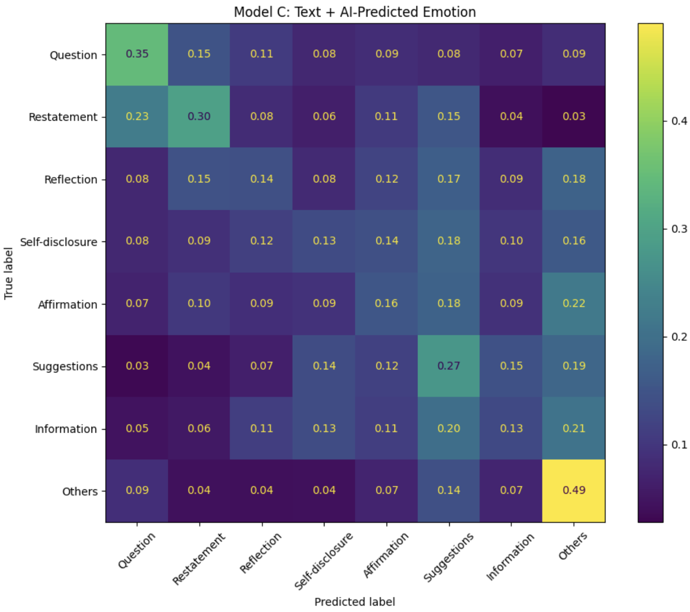

# Emotion-Aware Support Strategy Prediction

Exploring whether knowing a user's emotion helps AI choose better emotional-support strategies.

## Research question

**Even if AI knows what I'm feeling, how does it know what kind of response I need?**

This project investigates whether explicit emotion information improves support-strategy prediction in emotional conversations.

## Models

Using the ESConv dataset, I compare three multiclass logistic regression models:

- **Model A:** TF-IDF text only
- **Model B:** TF-IDF + self-reported emotion
- **Model C:** TF-IDF + AI-predicted emotion

The task is to predict one of the original eight ESConv support strategies.

## Experimental Setup

- Dataset: ESConv
- Task: 8-class support strategy classification
- Text representation: TF-IDF
- Classifier: Multiclass Logistic Regression
- Data split: Conversation-level train/validation split
- Evaluation:
  - Accuracy
  - Macro F1
  - Weighted F1
  - Confusion matrices
  - Qualitative error analysis

## Results

Adding explicit emotion information did not improve the model enough to outperform the text baseline.

However, the model using **AI-predicted emotion performed better than the model using the self-reported emotion label**, suggesting that inferred emotional signals still contain useful information for predicting support strategies.

## Main takeaway

**Recognizing someone's emotion is not the same as knowing what kind of support they need.**

Support strategy depends not only on emotion, but also on conversational context, intent, and what has already been said.

## Error Analysis

The confusion matrices show that some strategies are substantially easier to distinguish than others.

This suggests that improving emotional-support AI may require modeling conversational intent and dialogue context rather than relying primarily on emotion classification.

## Future work

This experiment intentionally uses a relatively simple model in order to isolate the effect of emotion features.

So possible extensions include:

- modeling multiple previous conversation turns
- combining emotion, intent, and dialogue-stage features
- testing whether emotion has a larger effect in specific support strategies
- examining feature importance and emotion-strategy relationships

## Tools

- Python
- pandas
- NumPy
- scikit-learn
- Hugging Face Transformers
- Matplotlib / Seaborn
- Google Colab

## Notebook

See [`emotion_support.ipynb`](emotion_support.ipynb) for the full implementation, experiments, and analysis.
